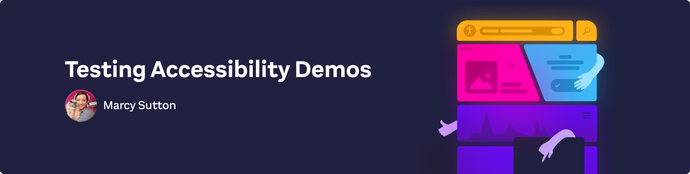

<div>
  <h1 align="center">✨ Testing Accessibility as Developers ✨</h1>
  <strong>
    Building accessible web applications with HTML, CSS, JavaScript, and React
  </strong>
  <p>
    Ensuring your frontend code is accessible requires consistent development effort and testing of inclusive markup and scripted interactions. In this workshop we’ll build an
    accessible web application using widely supported and proven tools and
    techniques. We’ll cover everything about building accessible frontend
    applications, from the absolute basics with HTML and CSS to the tricky parts you’ll run into building and testing JavaScript-heavy components.
  </p>

  <a href="https://testingaccessibility.com">
    
  </a>
</div>

<hr />

<!-- prettier-ignore-start -->
[![GPL 3.0 License][license-badge]][license]
[![Code of Conduct][coc-badge]][coc]
<!-- prettier-ignore-end -->

## Prerequisites

- The first workshop in the series on Manual Testing & Tools is intended for web developers of all skill and experience levels. Some knowledge of the Web Platform will be helpful (HTML, CSS, and JavaScript).
- In later workshops, the development exercises will become increasingly more advanced. Experience with JavaScript, React, and Git will be necessary.

## System Requirements

- [git][git] v2.13 or greater
- [NodeJS][node] `12 || 14 || 15 || 16`
- [yarn][yarn] v1

All of these must be available in your `PATH`. To verify things are set up
properly, you can run this:

```shell
git --version
node --version
yarn --version
```

If you have trouble with any of these, learn more about the PATH environment
variable and how to fix it here for [windows][win-path] or
[mac/linux][mac-path].

## Setup

> If you want to commit and push your work as you go, you’ll want to
> [fork](https://docs.github.com/en/get-started/quickstart/fork-a-repo)
> first and then clone your fork rather than this repo directly.
> Be sure to fetch the latest code on the day of the workshop by [syncing your fork](https://docs.github.com/en/pull-requests/collaborating-with-pull-requests/working-with-forks/syncing-a-fork).

After you’ve made sure to have the pre-requisites installed, you
should be able to run a few commands to get set up:

```
git clone https://github.com/marcysutton/testing-accessibility-demos.git
cd testing-accessibility-demos
yarn
```

There are periodic changes to this repo. To update your local build, run:

```
git pull
```

Note: if you have local changes, you'll need to commit them to a branch. Here's
some extra help on using Git: [https://www.freecodecamp.org/news/git-pull-explained/]

If you get any errors when building the site, please read through them and see if
you can find out what the problem is. If you can’t work it out on your own then
please [file an issue][issue] and provide _all_ the output from the commands you ran
(even if it’s a lot).

## Running the project locally

This monorepo contains various workshop files and a React web application. To get the app up and running (and really see if it worked) with [Parcel](https://parceljs.org), run this command from the project’s root folder:

```shell
yarn start
```

This should start the site for your browser at the address indicated in your Terminal, with an index page listing files and sections for each workshop:
`http://0.0.0.0:1234`

## Working through the exercises

### Workshop 1: Manual Testing & Tools

This part of the project has one **before** folder with **after** files for each of the 5 sections. The two pages we’ll work on in Workshop 1 are the Homepage and About page, starting from this URL: `http://0.0.0.0:1234/workshop1-manual-testing/exercises-start`

Here are the example source files for workshop 1:

- [exercises-start](https://github.com/marcysutton/testing-accessibility-demos/tree/main/workshop1-manual-testing/exercises-start)
- [exercise1-keyboard](https://github.com/marcysutton/testing-accessibility-demos/tree/main/workshop1-manual-testing/exercise1-keyboard)
- [exercise2-devtools](https://github.com/marcysutton/testing-accessibility-demos/tree/main/workshop1-manual-testing/exercise2-devtools/)
- [exercise3-extensions](https://github.com/marcysutton/testing-accessibility-demos/tree/main/workshop1-manual-testing/exercise3-extensions/)
- [exercise4-magnification](https://github.com/marcysutton/testing-accessibility-demos/tree/main/workshop1-manual-testing/exercise4-keyboard/)
- [exercise5-screenreader](https://github.com/marcysutton/testing-accessibility-demos/tree/main/workshop1-manual-testing/exercise5-screenreader/)

### Workshop 2: Automated Accessibility Testing with JavaScript

In workshop 2, we get more advanced with a React web application built out of the same monorepo. There are folders for each of the sections and the build will already be set up with the required tooling.

The URL for workshop 2 is: `http://0.0.0.0:1234/workshop2-automated-testing`

- [exercise0-storybook](https://github.com/marcysutton/testing-accessibility-demos/tree/main/workshop2-automated-testing/exercise0-storybook)
  - To start Storybook, run this command: `yarn storybook`
- [exercise1-jest](https://github.com/marcysutton/testing-accessibility-demos/tree/main/workshop2-automated-testing/exercise1-jest)
  - Run unit tests: `yarn test`
- [exercise2-cypress-components](https://github.com/marcysutton/testing-accessibility-demos/tree/main/workshop2-automated-testing/exercise1-cypress-components)
  - Run Cypress Component Tests: `yarn test:components`
- [exercise3-cypress-integration](https://github.com/marcysutton/testing-accessibility-demos/tree/main/workshop2-automated-testing/exercise3-cypress-integration)
  - Run Cypress integration tests: `yarn test:e2e`
- [exercise4-puppeteer](https://github.com/marcysutton/testing-accessibility-demos/tree/main/workshop2-automated-testing/exercise4-puppeteer)
  - Run Puppeteer with Jest: `yarn test:puppeteer`
- [exercise5-ci](https://github.com/marcysutton/testing-accessibility-demos/tree/main/workshop2-automated-testing/exercise5-ci)

### Workshop 3: Semantics & ARIA

In workshop 3, we'll dig into specifics of an important aspect of accessibility: semantics and ARIA in HTML markup. The accessibility information plumbed through your pages and applications with semantic code is essential for users of assistive technology. It assists other use cases as well, such as voice navigation and SEO.

Here, we will primarily work on site listings and associated components. The URL for workshop 3 is:
`http://0.0.0.0:1234/workshop3-semantics-aria`

- [exercise1-headings-landmarks](https://github.com/marcysutton/testing-accessibility-demos/tree/main/workshop3-semantics-aria/exercise1-headings-landmarks)
- [exercise2-what-is-aria](https://github.com/marcysutton/testing-accessibility-demos/tree/main/workshop3-semantics-aria/exercise2-what-is-aria)
- [exercise3-accessible-names](https://github.com/marcysutton/testing-accessibility-demos/tree/main/workshop3-semantics-aria/exercise3-accessible-names)
- [exercise4-programmatic-a11y-info](https://github.com/marcysutton/testing-accessibility-demos/tree/main/workshop3-semantics-aria/exercise4-programmatic-a11y-info)
- [exercise5-what-is-aom](https://github.com/marcysutton/testing-accessibility-demos/tree/main/workshop3-semantics-aria/exercise5-what-is-aom)
### Workshop 4: Interactions & Mechanics

Workshop 4 is my favorite topic in accessibility: user interactions and mechanics! We’ll dig into common patterns for keyboard interactions and how screen readers overlap. We’ll use JavaScript and advanced techniques to craft accessible experiences for a variety of user inputs.

- exercise1-the-keyboard
- exercise2-screen-reader-overlap
- exercise3-focus-management-js
- exercise4-announcements-with-at
- exercise5-advanced-scripting-aria
### Workshop 5: Design & People Skills

In workshop 5, we’ll mix things up a bit to discuss topics that are necessary to solve accessibility problems but focus more on design thinking or culture and less on code.

- exercise1-accessibility-as-ux
- exercise2-designs-prototyping
- exercise3-animation-motion
- exercise4-finding-answers
- exercise5-culture-of-accessibility

This structure will allow you to iterate on working files with separate directories for the example sections.

The purpose of an exercise is **not** for you to work through all the material.
It’s intended to get your brain thinking about the right questions to ask as
we go through the material together.

Contributions of any kind are welcome!

<!-- prettier-ignore-start -->
<!-->
[yarn]: https://classic.yarnpkg.com/lang/en/
[node]: https://nodejs.org
[git]: https://git-scm.com/
[license-badge]: https://img.shields.io/badge/license-GPL%203.0%20License-blue.svg?style=flat-square
[license]: https://github.com/marcysutton/testing-accessibility-demos/blob/main/LICENSE
[coc-badge]: https://img.shields.io/badge/code%20of-conduct-ff69b4.svg?style=flat-square
[coc]: https://github.com/marcysutton/testing-accessibility-demos/blob/main/CODE_OF_CONDUCT.md
[win-path]: https://www.howtogeek.com/118594/how-to-edit-your-system-path-for-easy-command-line-access/
[mac-path]: http://stackoverflow.com/a/24322978/971592
[issue]: https://github.com/marcysutton/testing-accessibility-demos/issues/new-->
<!-- prettier-ignore-end -->